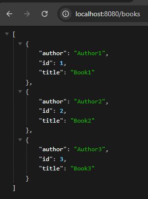
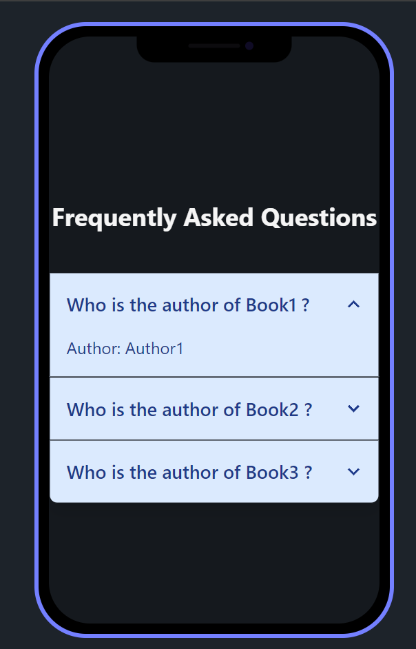

Project Description: 26. Frontend for REST API (React) : React frontend to interact with the REST API developed in the previous project

---

- TO RUN THIS PROJECT
  -YOU MAY JUST CLONE THE REPO OR PULL THE LATEST CHANGES FROM THE EXISTING MAIN BRANCH...
  -CHANGE THE DIRECTORY TO Frontend_Rest_API

  - RUN `npm install` OR `npm i` TO INSTALL ALL THE DEPENDENCIES
  - RUN THE PREVIOUS PROJECT 25 FLASK API TOO
  - RUN `npm run dev` TO START THE DEVELOPMENT SERVER

---

- PROJECT FEATURES

* USES AXIOS TO FETCH DATA FROM THE PREVIOUSLY CREATED FLASK API
* USES TAILWIND CSS AND DAISY UI LIBRARY FOR STYLING AND COMPONENETS

---

- THIS PROJECT MAPS THROUGH THIS DATA FROM OUR API
  

---

- AND SHOWS THE DATA AS AN ACCORDIAN COMPONENT
  
